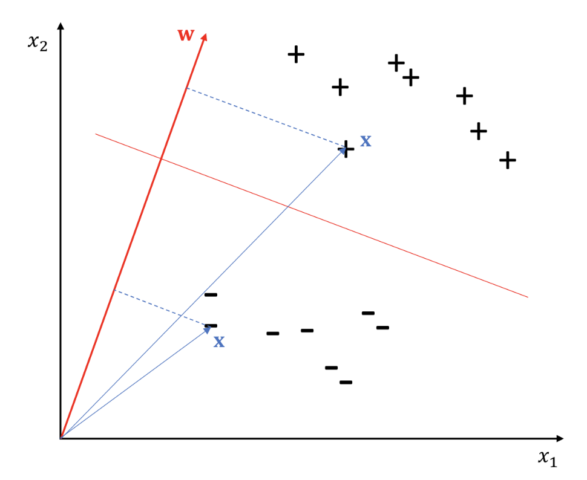
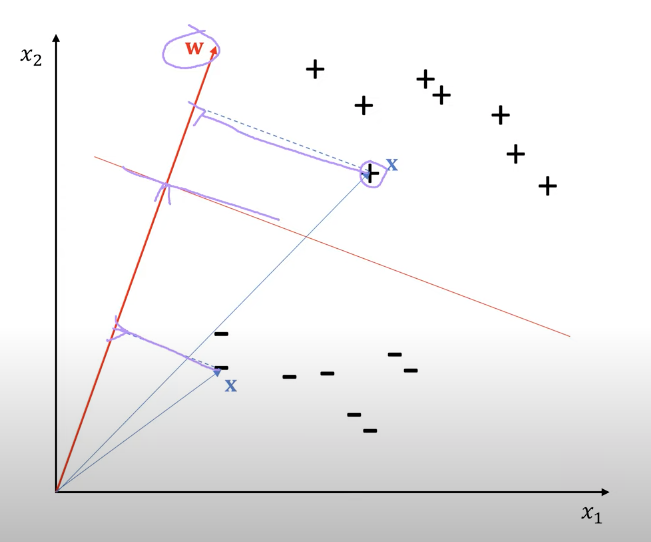
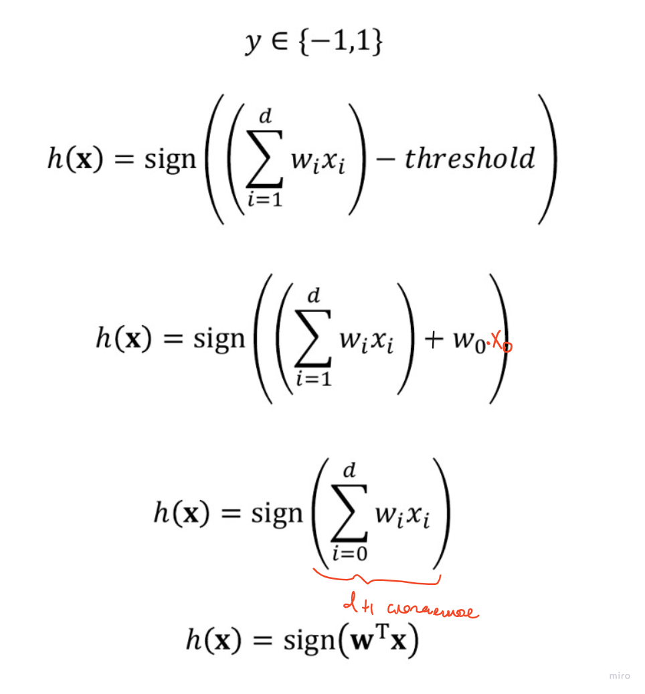
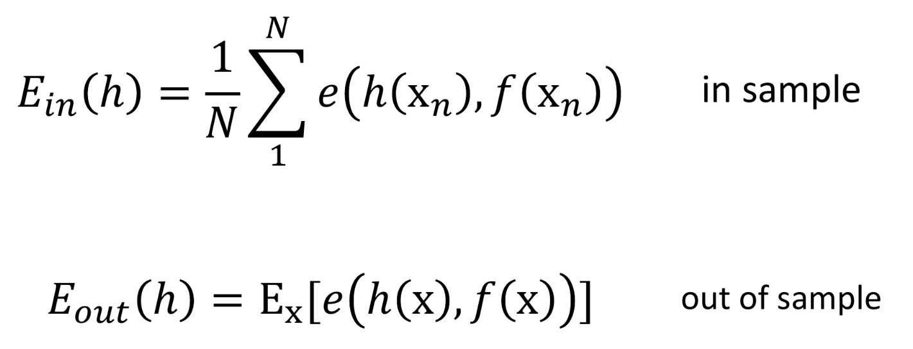
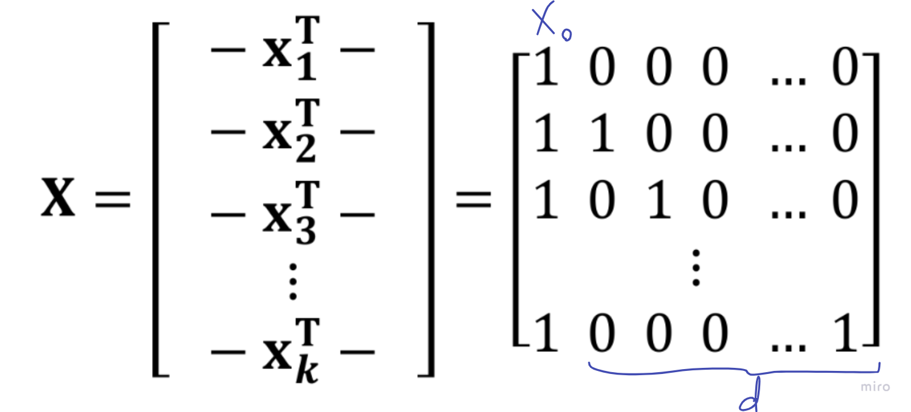

## Предисловие

1. Смотри презентацию 4: [ML_04_VC_Dimension.pdf](https://docs.yandex.ru/docs/view?url=ya-disk-public%3A%2F%2FTce3Hg4R521%2FAeGvN14%2FuhhBJbYmfaf3PaCuY7embqZnn%2BiIO%2BBq00rZ5aTL40zE%2Bb3nCKLCVTJ%2BSInaOUvvHQ%3D%3D%3A%2F%D0%9B%D0%B5%D0%BA%D1%86%D0%B8%D0%B8%2FML_04_VC_Dimension.pdf&name=ML_04_VC_Dimension.pdf).
1. Смотри лекцию 6: [YouTube](https://www.youtube.com/watch?v=8RM6OYFjW1g&list=PLxMpIvWUjaJsttwLkYi-uEydy6R9Hk2-v&index=6&ab_channel=UniversityProgramsITMO%2CHSE) (начало с 31:20; данная тема с 01:11:55).

**О чем тут речь:**

1. Что такое Perceptron.
1. Нер-во Вапника-Червоненкиса.
1. Точки поломки и дихотемии.

Данный билет связан с 12.1, так как использует некоторые его определения. Можно глянуть по диагонали. Снизу приведен контекст, необходимый для части 13.1.

### Perceptron (Перцептрон)

Это первая нейронная созданная сетка. Она решает задачу **линейной классификации множества точек**. Т.е., дано пространство с точками из **двух классов**, и нам нужно провести прямую (гиперплоскость) так, чтобы разбить это пространство на 2 кластера в соответствии с классами.

#### Как определить принадлежность точки к классу

Перцептрон - это наша гиперплоскость. Тогда построим к ней нормаль и проведем проекцию от рассматриваемой точки до этой нормали. Если координата спроецированной точки больше координаты точки, полученной при проекции перцептрона, то один класс; иначе - второй.

Как решается задача нахождения весов для перцептрона:

Т.е. $h(x)$ по $x$ определяет его принадлежность к классу $+1$ или $-1$. **Важно, что мы дописали свое слагаемое-свободный член в виде $w_0 x_0$**.

### Perceptron training

См. лекцию [36:20](https://www.youtube.com/watch?v=8RM6OYFjW1g&list=PLxMpIvWUjaJsttwLkYi-uEydy6R9Hk2-v&index=6&ab_channel=UniversityProgramsITMO%2CHSE) или [слайд 3](https://docs.yandex.ru/docs/view?url=ya-disk-public%3A%2F%2FTce3Hg4R521%2FAeGvN14%2FuhhBJbYmfaf3PaCuY7embqZnn%2BiIO%2BBq00rZ5aTL40zE%2Bb3nCKLCVTJ%2BSInaOUvvHQ%3D%3D%3A%2F%D0%9B%D0%B5%D0%BA%D1%86%D0%B8%D0%B8%2FML_04_VC_Dimension.pdf&name=ML_04_VC_Dimension.pdf).

Pocket algorithm и Feature engineering там же.

### Theory of error

Определения:

1. $E_{in}(h)$ - это ошибка внутри выборки $X$, которое равно среднему по ошибке в точке. Т.е. доля примеров, на которых мы с нашей гипотезой $h$ ошиблись.

1. Ошибка в точке $e(h(x_n), f(x_n))$ равна либо $0$ (если наша гипотеза $h$ правильно классифицирована $x_n$), либо $1$, если неправильно.

1. $E_{out}(h)$ - матожидание ошибки по $x$ (его мы не знаем).

### Hoeffding's inequality

Данное нер-во описывает как хорошо у нас $E_{in}(h)$ приблизит $E_{out}(h)$.

Если много гипотез подставлять в неравенство, то мы должны умножать то, что справа, на $M$ - кол-во гипотез, которое мы перепробовали:

Мы вводим понятие дехотемии:

Дехотемия - это почти как гипотеза $h$, но она определена только на множестве $x_i$ из датасета, а не на всем пространстве $X$. Это надо, чтобы $M$ в нер-ве выше ограничить.

**$m_{H}(N)$ = max кол-во дихотемий на $N$ точках при классе гипотез $H$.**

Далее определяем **точку поломки** (**breakpoint**), как минимальное кол-во точке $x_i$, для которых (при их хитром расположении) нельзя построить дихотемию, которая бы правильно их определяла по их классам $y_i$:

Зная $m_H(N)$ от _Hoeffding's inequality_ мы переходим к _Vapnik–Chervonenkis Inequality (VC inequality)_:

Далее мы показывали, что $M_H(N)$ полиномиально зависит от $N$, что дает хорошую оценку в нер-ве при больших $N$.

_Теперь у нас есть вся база для части 13.1_.

---

## 13.1 Размерность Вапника-Червоненкиса. VC-размерность для перцептрона, доказательство.

**Def**: Размерность Вапника-Червоненкиса (_VC-dimention_) $d_{VC}(H)$ для гипотез типа $H$ — это максимальное $N$ такое, что $m_H(N) = 2^N$.

При этом, есть явная формула для $d_VC(H)$ (за 1 шаг до точки поломки):

$$ d_{VC}(H) = k - 1 $$

Где $k$ - это _точка поломки_.

### Подсчет размерности Вапника-Червоненкиса для перцептрона

Пусть $d$ - размерность рассматриваемого пространства. Тогда размерность Вапника-Червоненкиса для перцептрона равна:

$$ d_{VC} = d+1 $$

**Док-во:**

См. [лекцию](https://www.youtube.com/watch?v=8RM6OYFjW1g&list=PLxMpIvWUjaJsttwLkYi-uEydy6R9Hk2-v&index=6&ab_channel=UniversityProgramsITMO%2CHSE) на 01:14:40.

Чтобы это доказать, нужно показать 2 свойства:

1. **(1): Доказать, что $d+2$ - это точка поломки**.
1. **(2): Доказать, что для $d+1$ все возможные _дихотамии_ получаются (их всего $2^{d+1}$)**.

**Док-во для (2):**

Напомним, что размерность перцептрона (т.е. его весов) равна $d$. Построим матрицу размера $d+1$ x $d+1$, где первый столбец - $x_0$, который есть добавочный член в веса перцептрона (см. лекцию 4 [31:28](https://www.youtube.com/watch?v=8RM6OYFjW1g&list=PLxMpIvWUjaJsttwLkYi-uEydy6R9Hk2-v&index=6&ab_channel=UniversityProgramsITMO%2CHSE), минуты 3-4):

Теперь мы хотим, чтобы наш перцептрон правильно классифицировал заданные точки (т.е. надо $w$ правильно подобрать). Мы это определяли, как равенство знака. Тогда решим такое уравнение:

$$y \in \{1, -1\}$$

$$ sign(Xw) = y $$

Усложним себе задачу и положим не равенство знака классу точки (т.е. $y$), а просто равенство:

$$ Xw = y $$

Так как $X$ мы определили как матрицу выше, и данная матрица обратима (т.к. нижнетреугольная), то $w$ явно выражается:

$$ w = X^{-1} y $$

Так мы построили решение (т.е. нахождение $w$) для любого переданной дихотемии $y$ в пространстве размера $d+1$.

**Док-во для (1):**

Отвечаем на вопрос, почему нельзя получить все возможные дихотемии на $d+2$ точках.

При такой размерности мы получаем матрицу размера $(d+1)$ x $(d+2)$:

Тогда в этой матрице есть линейная зависимость:

$$ x_j = \sum_{i!=j} x_i a_i $$

Сейчас мы явно построим пример, на котором мы не сможем решить уравнение со знаком выше ($sign(Xw)=y$).

Домножим на $w^T$:

$$ w^T x_j = \sum_{i!=j} w^T x_i a_i  \ \ (*) $$

Теперь сконструируем дихотемию, которая не получится ни при каком $w$:

Положим $y_i := sign(a_i)$ и $y_j := -1$.

Предположим, что мы нашли такой $w$, что он решает уравнение **(*)**, тогда:

$$ sign(Xw) = y \implies sign(w^T x_i) = y_i = a_i $$

Получаем, что $w^T x_i$ и $a_i$ одного знака, тогда наша сумма в **(*)** всегда положительна. При этом, $w^T x_j = y_j = -1 \implies$ левая сторона всегда отрицательна $\implies$ противоречие с тем, что $w$ - решение.

Получаем, что заданный $y$ - это дихотемия, которая не получается никаким $w$ $\implies$ $d+2$ - это точка поломки.

## 13.2 Глобальный поиск. Случайный поиск, grid search, случайное блуждание.

